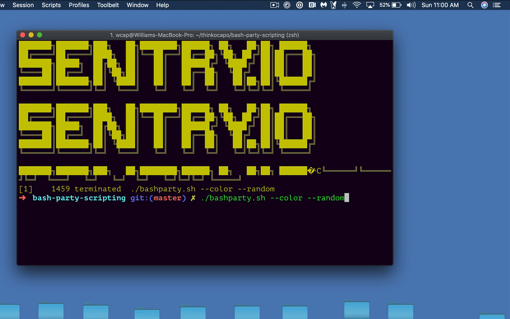

# bash-party-scripting
<!--  -->


## Setup
1. `git clone git@github.com:thinkocapo/bash-party-scripting.git`
2. `cd bash-party-scripting`
3. `mkdir songs`
4. `cp your_song.mp3 ./songs`

## Run
1. `./bashparty.sh` script with the following options:
``` bash
# plays first song in the directory
./bashparty.sh

# adds color
./bashparty.sh --color

# plays random song from ./songs
./bashparty.sh --random

# plays 3rd song from ./songs [0,1,2]
./bashparty.sh --index 2
```

## Troubleshooting
#### Song stuck running? Try
``` bash
ps aux | grep '<part_of_song_mp3_name>'
kill <pid>
```
#### Debugging in bash
```
set -x
...
set +x
```
#### Operating System
`afplay` is supported by Mac only.