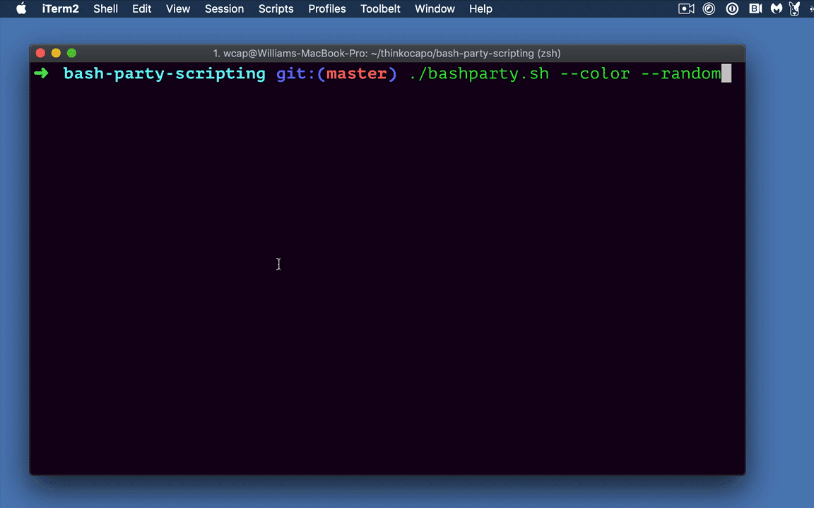

# bash-party
:tada: :sound: :loud_sound: [Music] :sound: :loud_sound: :tada:  



## Setup
1. `git clone git@github.com:thinkocapo/bash-party-scripting.git`
2. `cd bash-party-scripting`
3. `cp your_song.mp3 ./songs` or use the 5-second audio file that's already there

## Run
1. `./bashparty.sh` with the following options:
``` bash
# plays first song in the songs directory
./bashparty.sh

# adds color
./bashparty.sh --color

# plays random song from ./songs
./bashparty.sh --random

# plays 3rd song from ./songs [0,1,2]
./bashparty.sh --index 2
```

## Troubleshooting
When I was developing this the song got stuck running once.
``` bash
ps aux | grep '<part_of_song_mp3_name>'
kill <pid>
```
Debugging a script
```
set -x
...
set +x
```

Mac comes with `afplay` for linux you'll need something different.
